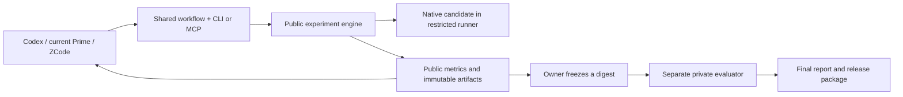

# Compression Lab: a deployable experiment system

Historical design decision, 2026-09-06, retained for provenance. Current research instructions and timing/completion behavior are defined by [RUN_CONTRACT.md](RUN_CONTRACT.md) and the sealed run configuration. The design below describes its original proposed release.

## Purpose and boundary

Build a small local product that lets an existing coding agent conduct credible compression experiments without rebuilding the benchmark infrastructure every time. Install it once, provide a dataset card, connect the agent, and receive immutable candidate packages with independently produced evidence.

The first release supports byte-exact compression of independent opaque objects, with a log/HCB adapter and a plain-byte adapter. Native C/C++/Rust candidates may implement new transforms, routing, or entropy coding. The system must not reduce research to selecting from a fixed menu. The existing agent remains responsible for hypotheses, interpretation, coding, and deciding which public experiment to try next. No LLM is allowed in the final codec runtime in release 1.

Use **one Python package and one command, `compression-lab`**, with an optional official MCP SDK extra. Ship a wheel, locked dependencies, a reproducible evaluator container recipe, a shared skill, host connection recipes, tests, and one end-to-end example. Do not add a web dashboard, cloud service, database server, custom agent orchestrator, or a new transform language.



MCP is a convenient standard transport, not the product and not a security boundary. A skill explains the workflow. Hooks can run quick checks or query eligibility when an agent stops. The executable engine makes release decisions consistently even when a hook is absent or ignored.

## What the operator does

The following is the target command experience, to be implemented and tested rather than advertised as existing:

```sh
uv tool install ./dist/compression_lab-0.1.0-py3-none-any.whl
compression-lab doctor
compression-lab init --dataset ./dataset-card.json --workspace ./experiment
compression-lab baselines prepare --workspace ./experiment
compression-lab connect codex --project ./experiment
# Alternatively: connect prime, or connect zcode.
```

The operator starts the chosen agent normally in the public workspace. The common skill tells it to call `profile`, inspect the cached baseline table, write a short hypothesis, and register a native candidate. The package installer must not start paid model calls, modify authentication, or send telemetry. It prints exact prerequisites and installation status.

After public work is ready, the owner runs `freeze` and `evaluate-private` from the evaluator environment. The agent cannot call these through its MCP interface. `export` builds a digest-bound archive containing the codec, source, build recipe, dependency inventory, and verified public/final evidence according to the owner's disclosure choice.

Installation is project-local where possible; the wheel is also usable in a normal virtual environment without `uv`. Pin tested dependency versions and hashes, vendor no unlicensed binaries, and provide a cacheable baseline build/install step. Do not use an unpinned `npx` or download codecs inside every model experiment. Dependency/setup failures should be ordinary actionable CLI errors.

## The three small implementation boundaries

| Boundary | Responsibility | Existing code to reuse |
|---|---|---|
| Dataset adapter | Canonical objects, manifest verification, groups, public splits, fixtures, descriptive profile | `phase1_hcb.py`, `phase1_data.py`, `phase1_stream.py`; plain byte files need a simpler adapter |
| Experiment engine | Candidate inventory/digest, build, invocation, baselines, gates, timing, accounting, ledger, artifacts | `phase1_candidate.py`, `phase1_candidate_benchmark.py`, `phase1_codecs.py`, baseline stream runners, quality tests |
| Access surfaces | CLI JSON commands, thin MCP wrapper, shared skill, host config install/uninstall | New small modules calling the same engine functions |

Private evaluation uses the same scoring implementation with separate permissions and owner state; it is not a second scoring algorithm. Reuse the current evaluator's intent but repair its access/state architecture where necessary. Do not copy historical assumptions about Windows launchers into the new engine. Do not import this repository's private data or old agent submissions into the implementation package.

The package may split modules by these responsibilities, but should have one source of truth for each result and gate. MCP and CLI must return equivalent result IDs and schemas. A generated report reads result JSON; it never recomputes metrics in a different code path.

## Dataset card and minimal adaptive prompt

Only dataset-specific facts belong in the card. Public and owner-only manifests are separate files. The public card contains no hidden paths, samples, per-test statistics, or test-object identifiers.

```json
{
  "schema_version": 1,
  "dataset_id": "logs-example",
  "adapter": "hcb1",
  "public_manifest": "public/manifest.json",
  "group_key": "source_group",
  "development_policy": {"folds": 5, "seed": 20260906},
  "input_domain": "valid HCB1 bundles; arbitrary content bytes",
  "objective": {
    "encode_floor_bytes_per_second": 100000000,
    "decode_floor_bytes_per_second": null,
    "deployment_canonical_bytes": 100000000,
    "rank_by": "deployment_total_bytes"
  },
  "limits": {"threads": 1, "memory_bytes": 2147483648, "timeout_seconds": 120},
  "search_budget": {"candidate_evaluations": 30, "wall_seconds": 7200}
}
```

The deployment horizon above is an example, not a retroactive change to the log experiments. The operator fixes it before a run. Report per-object distributions and a horizon sensitivity table too. Group splitting must precede dictionary training and every learned artifact. Chunk boundaries, object ordering, and source provenance are explicit in manifests; never randomly split lines from the same source group across train and development.

The reusable prompt is approximately:

> Read the Compression Lab skill and this run's public card. Use the engine's profile and baselines. State one falsifiable compression hypothesis and its likely fixed-cost/speed trade-off. Implement a reversible native candidate. Use quick evaluation while iterating, then full public evaluation for promotion. Keep the best eligible candidate and the negative results. Do not access private evaluation, reinterpret a failed gate, or use test feedback to tune. Return the candidate digest and engine result ID. Stop when the budget or terminal state is reached.

The engine supplies stage-specific facts: initial profile and baseline table; after a quick failure, concise error and public reproduction; after a full result, per-group changes, fixed costs, timings, eligibility, and the next allowed actions. It does not automatically rewrite the scientific objective. Avoid repeatedly injecting source trees, raw traces, and complete reports into context. The root can request a specific artifact when needed.

## Public API and candidate interface

Expose a small versioned operation set:

| Operation | Input | Output |
|---|---|---|
| `profile` | Run ID | Corpus composition, group counts, byte/token-pattern summaries and small public examples |
| `baselines` | Run ID and declared matrix | Cached full metrics, runtime fingerprint, eligible-size frontier |
| `evaluate` | Run ID, candidate path/digest, `quick` or `full` | Job ID immediately, then immutable result ID |
| `status` | Run/job/result ID | Stage, progress, short result or reason code, next allowed operations |
| `artifact` | Result ID and allowlisted artifact name | Bounded text/resource or file path plus hash |
| `cancel` | Running job ID | Process-tree cancellation and terminal cancelled result |

CLI output is JSON with `schema_version`, `run_id`, `job_id`, `candidate_digest`, `status`, `reason_codes`, `metrics`, and artifact references. Stdout remains machine-readable; diagnostics go to stderr. Results should usually fit within 4 KB. Long work runs in a subprocess with durable job state and bounded output, avoiding MCP request timeouts. One active benchmark per host lock prevents concurrent timing jobs. No permanent daemon is required.

Keep existing candidate registration concepts: argument arrays rather than shell strings, declared source/artifact/runtime paths, deterministic operation, explicit thread count, and directory plus packed-stream encode/decode. A new versioned manifest adds a build recipe, toolchain/dependency lock, input-domain declaration, and optional public hypothesis. Registered paths cannot escape the package, follow symlinks, or smuggle undeclared data. Snapshot before execution; build and benchmark only that snapshot.

The model can write any native algorithm consistent with the domain. Every independently encoded object must decode with only its archive plus declared fixed package. Intra-object adaptive templates are fine if reconstructed from encoded information. Cross-object hidden encoder state, filename lookup tables, extra dictionaries fetched at runtime, and uncharged dependencies are not allowed. Raw/literal fallback is the default escape hatch for unusual content.

## Quality gates that would have caught this audit's failures

`quick` runs a small deterministic public sample, all mandatory boundary fixtures, registration checks, and exact round trips. Proxy timings may guide search but are labelled `proxy`; a quick result is never promotable. `full` rebuilds the immutable candidate and executes every release gate below.

| Gate | Required behavior | Failure prevented |
|---|---|---|
| Build and inventory | Build from declared source in a clean pinned environment; hash output and dependencies; reject undeclared byproducts | Stale binaries and source-packaging ambiguity |
| Byte exactness | Compare every decoded byte of every public object; deterministic repeat; independence under reorder/subsets | CRC-only claims, cross-object state, silent normalization |
| Valid-input boundaries | Empty data, all byte values, NUL/control markers, long numbers, many fields/slots, odd calendar text, newline variants, tiny/large objects | GLM OpenStack timestamp, marker, and slot-limit failures |
| Interface parity | Directory and stream operations, short/long aliases and several prefixes, all names/lengths reconstructed exactly | Unterminated alias handling masked by a public prefix |
| Native diagnostics | ASan/UBSan build on bounded fixtures; bounded property/fuzz campaign with seed, duration and saved reproducers | Numeric-string and alias heap reads |
| Invalid archives | Truncation, mutation, framing/length corruption, trailing bytes according to the declared format; explicit failure, no successful partial output | Decoder acceptance and resource abuse |
| Resource policy | Timeout, memory/process/thread limits, no candidate network, declared filesystem only | Benchmark contamination and undeclared state |
| Size accounting | Inventory all required bytes and publish all cost views | Small-corpus regressions hidden behind archive savings |
| Real timing | Fresh native process, actual packed-stream API, matched host and pinned workload, seven trials | Proxy/native-launch disagreement |
| Freshness | Gate digest exactly matches submitted source, binary, artifacts, card and runtime identity | Editing after a successful test |

A tiny fixture set must exercise the format boundary, not just ordinary dataset examples. The implementation handoff contains the 35 public/synthetic fixtures from this audit, but should supplement them with generic generated cases and stream names. Tests must accept legitimate arbitrary content within the adapter's domain. Unsupported inputs cannot simply be excluded after a failure.

Sanitizer output is a correctness signal, never the throughput measurement. A candidate requiring unsupported tooling is `blocked_toolchain`, not passed. ASan cannot prove correctness; record scope and seed. Corruption protection is part of the archive contract and must be charged; standard codecs without it receive the same integrity wrapper. A decoder error after encoding a valid input is a failed round trip.

Encode speed is canonical bytes divided by complete encode elapsed seconds, in decimal MB/s. Time the real process invocation, input/output, transform, and backend; exclude one-time toolchain installation and include startup costs on the declared workload. Record all seven trials, median, dispersion, warmup policy, CPU model/affinity, power state where available, compiler flags, OS and dependency hashes. The release criterion is median encode >=100 MB/s. Decode speed, peak RSS and binary footprint are reported; there is no default decode gate. Encourage headroom around 110 MB/s but do not invent a second threshold.

Noisy/incomplete measurements are invalid and require an explicitly logged rerun; never keep only the fastest attempt. CI runs correctness and checks measurement arithmetic. The 100 MB/s assertion runs on the designated benchmark host, not an arbitrary shared CI VM. A smoke benchmark cannot certify speed.

## Accounting and attribution

Always publish archive bytes, fixed dictionary/model bytes, standardized packed-source description, canonical config, custom executable bytes, and required runtime/dependency footprint. Avoid double charging a file listed in two manifest categories. Retain both source-based scientific accounting and binary-based deployment accounting; state exactly what the baseline already assumes installed.

For release 1, use a single pinned deterministic source-packaging rule for all candidates. Report:

1. Historical-compatible primary: archives + dictionary/model + packed source/config.
2. Deployment total: archives + required dictionaries/config + shipped executable and non-platform runtime dependencies, with a declared installed-runtime policy.
3. The historical additive source-plus-binary view, when comparing to old results, clearly labelled.

Do not optimize on test-set size. Rank at the predeclared deployment horizon and show actual-partition totals alongside the projection. Include compression ratio, bits per canonical byte, per-group outcomes, tail regressions, and paired group-bootstrap uncertainty. Projection assumptions must remain visible.

Prepare conventional controls once: stored/raw, Zstandard levels with/without train-only dictionaries, LZ4, Brotli, and XZ where supported. Distinguish the best size baseline from the best baseline meeting the speed floor. Log-specific systems such as CLP can be later external controls; integrating a large stack is not a prerequisite to the first release.

Also run a deterministic parameter/random-search control under the same number of evaluations and wall budget. If the LLM only selects a conventional setting, its gain belongs to that search, not a novel algorithm. For learned routing, charge features, inference time, router description, and route IDs; compare against a fixed best route. Oracle routing is a diagnostic upper bound only.

## Isolation, freeze, and recoverability

There are two separate trust problems: the agent must not see held-out data, and generated native programs must not access evaluator secrets or mutate evidence. Hiding tools in MCP does not solve either if the agent can read the same files with its shell.

Run agents in a public-only environment, using a separate OS identity or a container/mount boundary whose filesystem has no private corpus, evaluator state, or owner credentials. Provider login belongs to that agent environment, outside the repository. The private evaluator runs under the owner outside that environment. Generated candidate builds and executions use a restricted subprocess sandbox: no network, read-only pinned runtime/candidate/input mounts, a fresh writable output/temp directory, and bounded resources. On supported Linux, bubblewrap is a small native option; a pinned OCI evaluator is the portable deployment recipe. A fresh network-isolated bubblewrap smoke call worked on the audit host.

The first release's **certified runtime is Linux x86-64**. The CLI/protocol can be portable, but Windows/macOS release timing and native sandboxing must be explicitly unsupported until implemented and tested. Codex, Prime and ZCode compatibility does not imply every operating system is certified. If agent/private separation or the candidate sandbox cannot be verified, `doctor --release` and private promotion fail closed; public exploratory mode can still run with an explicit non-release status.

Owner state follows `created -> public_search -> public_ready -> frozen -> private_started -> complete`. Failure/cancellation is recorded distinctly. Before reading a hidden byte, atomically record `private_started` and the frozen digest under a lock. A crash may resume only that digest and run ID; it must not grant a fresh test attempt or partial feedback to the agent. The owner controls when final aggregate results become visible. After disclosure, the test is consumed for adaptive development purposes.

Use atomic JSON snapshots plus an append-only JSONL event journal and a single-writer lock. Each record includes event ID, previous state, candidate/card/runtime digests, command/result references, and timestamps. Bound captured output; store large artifacts separately by hash. A terminal latch prevents automatic continuation from converting `complete` back to `active`. New research requires a new run ID and authority. No database server is needed.

## Codex, modern Prime, and ZCode

Maintain a tested capability matrix, not a dependency on one UI version. All three can use the CLI directly. MCP adds discovery and structured calls when supported; a shared `.agents/skills/compression-lab/SKILL.md` supplies the common instructions, with an explicit skill flag/recipe for hosts that need it. Prefer documented external interfaces over patching harness internals.

| Host | Integration contract |
|---|---|
| Codex | Register a local stdio MCP process using its documented `mcp add` command or project configuration. Local CLI syntax was checked. Shared skills are the normal workflow entry. |
| Prime Agent | Current stable 0.9.2 was installed side by side and its native MCP CLI verified: `prime-agent mcp add compression-lab --cwd /absolute/project -- /absolute/python -m compression_lab.mcp_server`. Installed docs expose `await mcp.list_tools(name)` and `await mcp.call_tool(name, tool, args)` in its Python environment. The CLI remains a fallback. Never invoke unknown help subcommands that might be treated as prompts. |
| ZCode | Use documented workspace MCP configuration and shared skills. Native `.zcode/config.json` MCP servers can override shared `.agents/mcp.json` fallback in the same scope; merge the owned entry into the active configuration instead of assuming fallback works. |

`connect` previews and applies only an owned server/skill entry, preserves unrelated configuration, writes an atomic backup, and uses the interpreter/executable's resolved absolute path. `disconnect` removes only unchanged owned entries. Repeated install/uninstall is idempotent. Never overwrite an entire user configuration or read/export authentication. A capabilities probe runs version/help and an MCP initialize/list-tools/one-safe-call smoke test without requesting a model completion. Unsupported versions receive a precise CLI fallback and status.

Local Prime verification used the official v0.9.2 release tarball with a matching published SHA-256. It is available at `/path/to/prime-agent-0.9.2/bin/prime-agent`. Existing 0.7.2 processes and the default launcher were preserved because other sessions are running. Postinstall bootstrap and a new model session were not exercised. These are installation/CLI facts, not a claim that the future Compression Lab MCP server has already been integrated. Details: `results/log_agent_audit_2026-09-06/prime_current_compatibility.json`.

Hooks are optional accelerators: after edits, debounce the quick fixture suite; on stop, query a current-digest eligibility result. They do not run the whole benchmark after every tool call and do not claim private release. Prime's autonomous gate can call the same status command. The deployment does not rely on any one host's hook lifecycle or privileged extension API.

Current official references, accessed 2026-09-06:

- [MCP tools specification, protocol 2025-06-18](https://modelcontextprotocol.io/specification/2025-06-18/server/tools): schema-based tools and result/resource transport. Use a tested official SDK version and keep the engine transport-independent.
- [Official Python MCP SDK releases](https://github.com/modelcontextprotocol/python-sdk/releases): select and lock the API actually tested; do not assume old FastMCP import paths survive SDK changes.
- [Codex MCP documentation](https://learn.chatgpt.com/docs/extend/mcp?surface=cli) and [skills documentation](https://learn.chatgpt.com/docs/build-skills): maintained pages, no single publication date.
- [Prime MCP integration documentation](https://github.com/PrimeIntellect-ai/prime-agent/blob/main/packages/coding-agent/docs/mcp-integrations.md) and [Prime v0.9.2 release](https://github.com/PrimeIntellect-ai/prime-agent/releases/tag/v0.9.2), published 2026-09-05. The old experiment's orchestration failures are historical evidence, not a review of the current release.
- [ZCode MCP services](https://zcode.z.ai/en/docs/mcp-services): maintained documentation, cross-checked against the installed configuration guide.
- [AddressSanitizer](https://clang.llvm.org/docs/AddressSanitizer.html) and [libFuzzer](https://llvm.org/docs/LibFuzzer.html): maintained compiler documentation.

## Definition of a deployable first release

The handoff should return an actual source tree plus built wheel/ZIP and test results, with:

- Clean installation in a fresh environment; pinned dependencies; `doctor` with meaningful failure reasons; documented upgrade/uninstall.
- A working public profile/baseline/register/evaluate/status/export loop on bundled tiny log and byte examples, using a real native candidate and exact reconstruction.
- The same public loop through CLI and real MCP protocol calls; host connection fixtures and current-version capability evidence for Codex, Prime and ZCode. Report live client testing separately from config-fixture testing.
- Release gates that reject deliberately broken synthetic candidates for alias termination, numeric normalization, missing artifacts, stale digests, hidden-state leakage, timeout and wrong output; no historical private data are needed.
- Proven private-access separation, restricted native execution, immutable freeze, one-test state semantics, crash recovery, job cancellation, and completion latch. A missing isolation backend must block certification.
- Reproducible native timing, all accounting views and dependency inventory; a real baseline may fail 100 MB/s on the builder host without making the harness incorrect. Never fabricate a passing speed result.
- A concise operational README, common skill, dataset-card schema, one-command model-free acceptance demo, and a clear list of unsupported environments.

Build the release boundary first. Then run equal-budget Sol/GLM experiments across at least two dataset families, followed by fresh held-out evaluation. Keep one root and at most one optional cheap scout with a bounded structured result. Do not rebuild Prime/Codex/ZCode orchestration. This is enough machinery to test whether an LLM produces better valid codecs, while leaving the scientific decisions visible and the installation practical.
